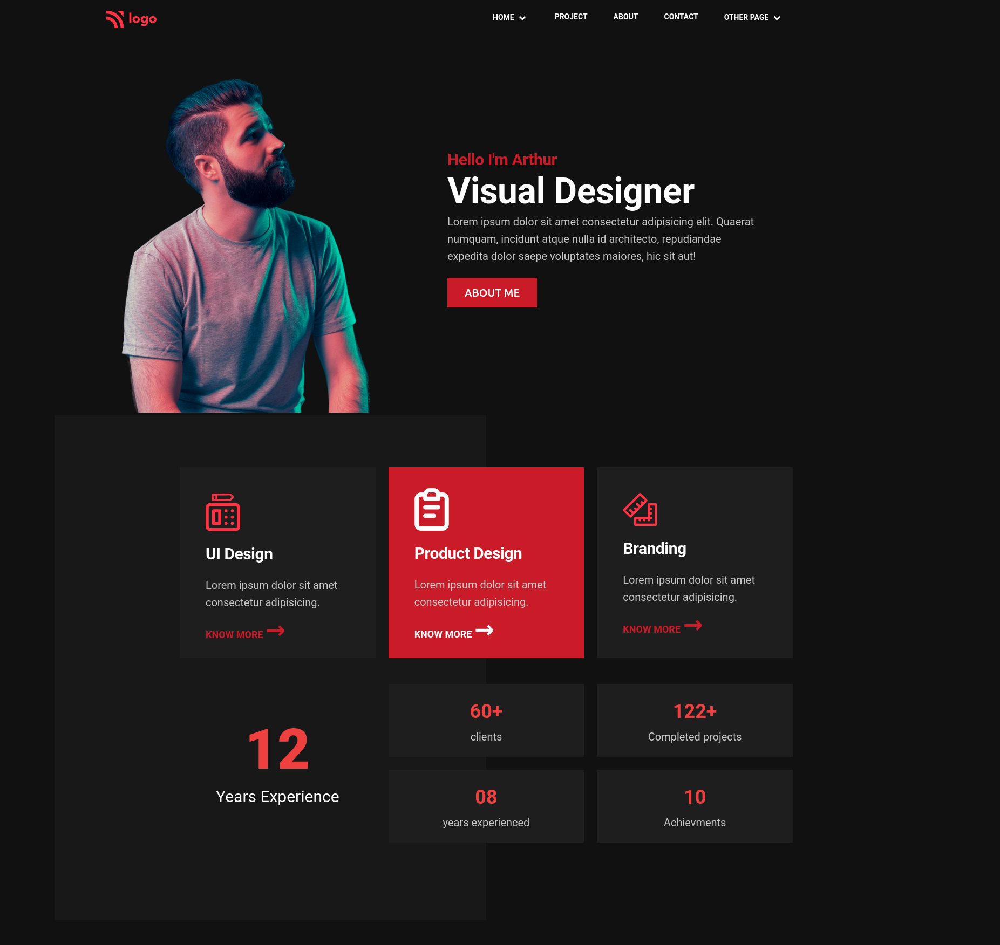
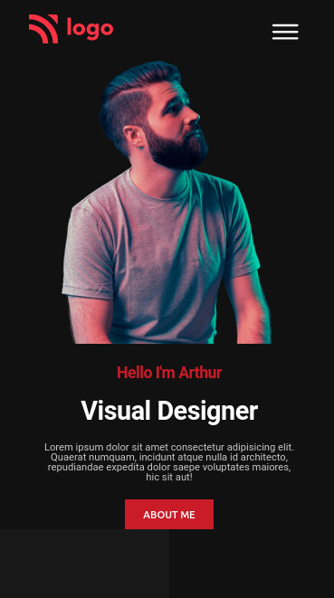

# PROJECT 15 - Product Design Landing

This is the 15th project among the 15 HTML and CSS Ineuron-projects.

## Table of contents

- [Overview](#overview)
  - [Screenshot](#screenshot)
  - [Links](#links)
- [My process](#my-process)
  - [Built with](#built-with)
  - [Time required](#time-required)
  - [What I learned](#continues-development)
  - [Useful resources](#useful-resources)
- [Author](#author)
- [Acknowledgments](#acknowledgments)

## Overview

### Screenshot




### Links

- Code File URL: [github.com](https://github.com/Jyotimoykathar/Project-02)
- Live Site URL: [netlify.app](https://project-02-restaurant.netlify.app/)

## My process

### Built with

- Semantic HTML5 markup
- CSS custom properties
- Flexbox Css
- Grid Css

### Time required

Nearly 4 day required to figure out the entire position of the sections in sequence and towards completion.

### What I learned

This is the css design code snippet of the media queries that I learned.

```css
/* Below 544px(Phones) */
@media (max-width: 34em) {
  .grid--2-cols,
  .grid--3-cols {
    grid-template-columns: 1fr;
  }
  .grid--2-cols {
    justify-items: center;
  }
  .logo-box {
    position: absolute;
    left: 4rem;
  }
  .heading-secondary {
    font-size: 2.4rem;
    line-height: 1;
    margin-bottom: 1.4rem;
  }
  .icons {
    font-size: 2rem;
  }
  .experience div span {
    font-size: 2.8rem;
  }
  .experience .twelve {
    font-size: 1.8rem;
  }
  .experience .twelve .large {
    font-size: 7rem;
  }
  .btn-red {
    font-size: 1.4rem;
    padding: 1.2rem 2.6rem;
  }
  .right-hero-description {
    padding: 0 4rem;
    text-align: center;
  }
  [alt="bottom nav logo"] {
    width: 8rem;
  }
}
```

### Continued development

I still have a lot to learn about CSS Grid and Media Queries.
Animation and JS need to be added to make the page more interactive and beautiful.

### Useful resources

- [MDN](https://developer.mozilla.org/en-US/) - This website helped me to any thing i had to look upon.
- [ION ICONS](https://ionic.io/ionicons) - This is an amazing website with open source icons that helps to add icons easily to your webpages.

## Author

- Github page- [Jyotimoykathar](https://github.com/Jyotimoykathar/)

## Acknowledgments

Special Thanks to Ineuron team for the Project to learn and improve my CSS Grid and Media Querie skills.
